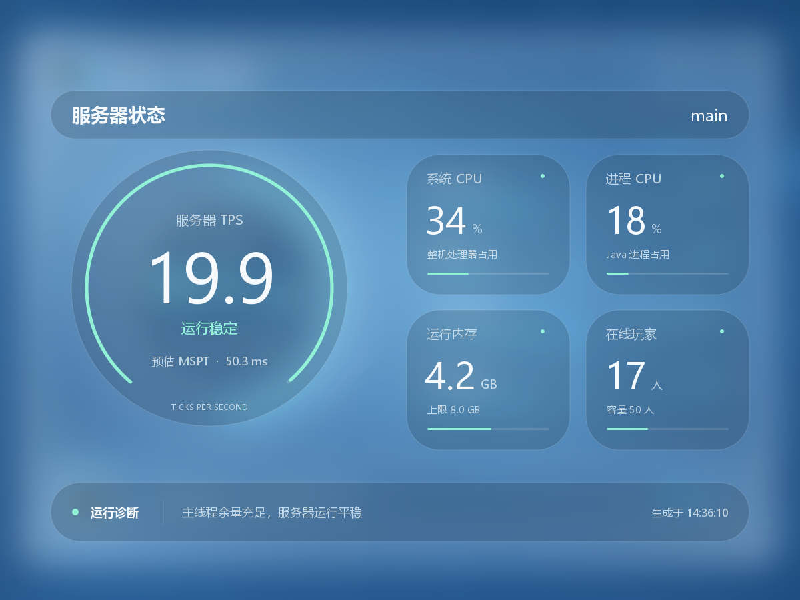

# HuhobotMonitor

HuHoBot 的服务器性能监控 Addon。QQ群发送 `/服务器状态` 后，插件在 Bukkit 主线程抓取轻量快照，在独立线程中回复 1200×900 性能面板或纯文字状态。



## 当前接入方式

- 面向 HuHoBot/PenguinClient 当前主分支，直接使用 `Addon` 元数据和 `QClient.registerCommand(addon, command)` 注册。
- HuHoBot 尚未启动 QQ 客户端时每秒重试；注册成功后命令会进入 AddonManager 并同步至 QQ 指令面板。
- 不再把 HuHoBot 的 `BaseCommand`、`Commands` 或 `Addon` ABI 桩打包进插件 JAR。
- `HuHoBotPenguin` 是硬依赖，必须先于本插件加载。

默认命令 `/服务器状态` 走新版 Addon 接口。若修改 `bot-command`，插件会使用 HuHoBot 的自定义命令事件入口兼容动态命令名。

## 文字模式与自动回退

默认仍回复图片，图片生成或发送失败时自动尝试文字回复。流量计费服务器建议在 `config.yml` 配置：

```yaml
reply:
  mode: text
  fallback-to-text: true
```

- `reply.mode`：`image`（默认）或 `text`。纯文字模式不初始化图片接口，不加载底图/字体，不生成或上传图片；文字发送本身仍有少量网络流量。
- `reply.fallback-to-text`：默认 `true`。图片初始化失败时本次运行使用文字，重启后重新尝试初始化；图片生成或发送失败时仅本次请求回退文字。关闭后图片请求失败只回复失败提示，图片初始化失败则插件停止启用。
- 回复形式仅在 `config.yml` 中切换，QQ群始终发送 `/服务器状态`，不提供文字/图片切换参数。
- 文字包含服务器名称、状态、TPS、MSPT、两项 CPU、内存、在线玩家、诊断及时间。优先显示真实 MSPT，不支持时标明“预估 MSPT”；无法采集的指标显示 `--`。
- 图片与文字共用采样、阈值、冷却和并发限制。文字发送失败只记录日志，不循环重试；网络超时等不确定结果可能导致图片与回退文字同时到达。
- 首次生成的 `config.yml` 自带中文填写说明、`mode: image` / `mode: text` 示例及回退开关说明。修改配置后重启生效。旧配置不会被覆盖；缺少 `reply` 时沿用图片模式并默认开启文字回退，需要纯文字时手动添加上面的配置。

## 自定义底图

首次以图片模式启动会创建：

```text
plugins/HuhobotMonitor/assets/custom/backgrounds/
```

把 PNG 放入该目录，例如 `performance.png`，然后修改配置：

```yaml
render:
  font-family: ""
  surface-opacity: 0.12
  adaptive-backdrop-dimming: true
  maximum-backdrop-dimming: 0.38
  glass-blur-radius: 0
  custom-background:
    enabled: true
    file: performance.png
    fit: cover
```

- `cover`：保持比例，居中裁切到 1200×900。
- `stretch`：直接拉伸到 1200×900。
- `file` 只接受当前目录内的安全 PNG 文件名，不允许路径穿越。
- 文件最大 16 MiB、解码后最大 3200 万像素。底图只在启用时加载一次。
- 背景和透明信息层独立合成。自适应只轻度降低整张底图的视觉冲击，卡片本身使用浅烟灰透明材质；可选模糊只作用于标题栏、圆形仪表、四张指标卡和底部诊断条内部，文字不参与模糊。
- 标题栏内“服务器状态”居左，`server-name` 指定的服务器名称居右；超长名称自动省略。生成时间显示在底部诊断栏右侧，诊断文字为时间预留间距；顶部不绘制品牌文字。
- `render.surface-opacity` 控制浅烟灰卡片材质，默认 `0.12`；建议保持在 `0.08–0.16`。它不是黑色遮罩，数值越低，底图颜色和轮廓在卡片内越明显。
- `render.adaptive-backdrop-dimming` 根据整张底图亮度计算轻度全局压暗，让白字稳定而不把每张卡片涂黑。`render.maximum-backdrop-dimming` 默认 `0.38`，限制最亮照片最多被压暗多少；关闭后完全保留原始底图亮度。
- `render.glass-blur-radius` 控制可选的局部高斯模糊，范围 `0–64` 像素，默认 `0`。默认关闭是为了让人物、插画等自定义底图保持干净；喜欢磨砂效果时建议从 `8–16` 尝试。它与透明度独立调节，模糊结果在插件启用时缓存，修改配置后重启插件生效。
- TPS 使用圆形主视图，四项指标使用大圆角小组件。浮层采用单层中性颜色，不叠加偏蓝渐变或硬阴影。
- 自动选择支持中文的无衬线字体；Windows 使用 Microsoft YaHei UI，Linux 建议安装 Noto Sans CJK SC。

未启用时继续使用内置的运行核心底图。

## 指标来源

- TPS：优先读取服务端公开入口和兼容字段，最后使用插件自己的 60 秒 tick 采样器。
- MSPT：真实平均 tick 时间参与健康判断；图片以 `1000 / TPS` 显示明确标注的“预估MSPT”，文字优先显示真实 MSPT，不支持时再显示估算值。
- 系统 CPU、进程 CPU：来自 JVM 操作系统管理接口；不支持时显示 `--`。
- 运行内存：当前 Java 进程已用堆内存与最大堆内存。
- 在线玩家：Bukkit 当前在线人数与服务器人数上限。

## 安装

1. 安装并配置当前主分支的 HuHoBotPenguin Spigot/Paper 适配器。
2. 将 `HuhobotMonitor-*.jar` 放入服务器 `plugins` 目录。
3. 重启服务器，在 QQ 群发送 `/服务器状态`。

从旧版 HuHoBotPerformance 升级时：先停服，将旧 JAR 移出 `plugins`，不要同时加载两份插件；将旧数据目录 `plugins/HuHoBotPerformance` 重命名为 `plugins/HuhobotMonitor`，保留配置与自定义底图，并把原配置中的 `bot-command` 改为 `服务器状态`。若目标数据目录已存在，请先备份并手动合并，不要覆盖。原管理权限需要改为 `huhobotmonitor.admin`。

支持 Spigot/Paper 1.16.5 及以上，插件产物保持 Java 8 字节码。

## 本地预览

服务器控制台或拥有 `huhobotmonitor.admin` 权限的玩家可以生成预览：

```text
/huhobotmonitor preview healthy
/huhobotmonitor preview warning
/huhobotmonitor preview critical
/huhobotmonitor preview unavailable
```

图片模式的预览写入 `plugins/HuhobotMonitor/preview-状态.png`；纯文字模式（或图片初始化失败后）直接向命令发送者展示文字预览，不写入 PNG。不启动服务器时可运行：

```powershell
.\gradlew.bat renderPreview
```

默认预览输出为 `build/preview/performance-preview-v2.png`。
同时输出 `performance-ui-neutral.png`（纯色衬底排版预览）和 `performance-ui-transparent.png`（1200×900 透明信息层），方便设计底图时叠加检查。
透明 PNG 包含文字与浅烟灰卡片材质；全局压暗和可选模糊依赖实际底图，只在最终合成图中展示。命令行预览类可依次传入模糊半径、自适应压暗开关和最大压暗强度，例如 `0 true 0.38`。

## 构建与测试

先构建同级目录中的 `PenguinClient-Main`，确保存在：

```text
../PenguinClient-Main/common/Bot/build/libs/common-Bot-1.5.0.jar
```

然后运行：

```powershell
.\gradlew.bat clean test build renderPreview
```

发布 JAR 位于 `build/libs/`。可用 `-PhuhobotQqSdkJar=...` 或环境变量 `HUHOBOT_QQ_SDK_JAR` 指向其他当前主分支构建产物。
